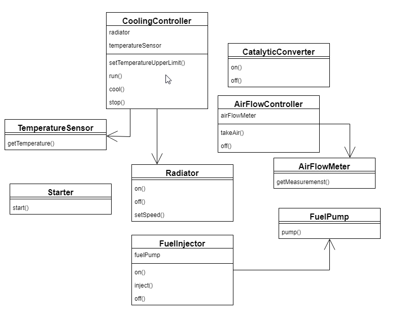
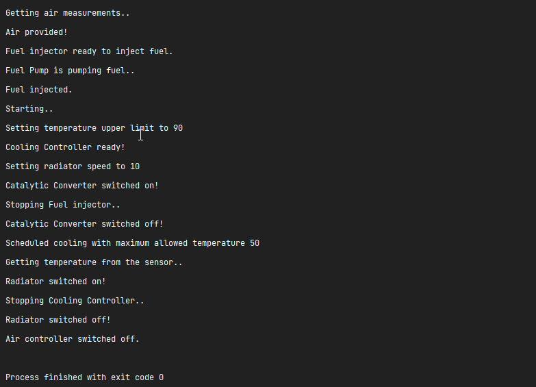

**Паттерн проектрования - Facade**

Допустим, мы хотим завести машину. На следующей схеме представлена система, которая позволяет нам это сделать:

1 часть - запуск двигателя

* Сперва **air flow controller** поддерживает стабильное давление в системе
* Далее требуется запустить **fuel injector**
* Топливный насос качает топливо  **fuel pump**
* **fuel injector** впрыскивает топливо в впускной коллектор, воздух и топливо смешиваются.
* Затем при повороте ключа, **starter** подаёт мощность на двигатель и заставляет его вращатся
* Установка верхнего предела температуры на дефолтное значение и запуск **radiator**

2 часть - остановка двигателя

* Остановить **fuel injector**

* Охладить двигатель

* Прекратить подачу кислорода

**Скришот роботы программы**

